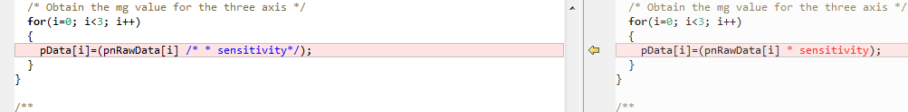

# ATTITUDE HEADING REFERENCE SYSTEM

by Hariprasath SHANMUGASUNDARAM, Sandeep Gopala Krishnan
ISAE SupAero, MS EMS students 2015-2016

# Introduction

This project illustrates how to build an Attitude Heading Reference System using FreeRTOS targets on ST Discovery kit using Ocarina tool and PolyORB-HI-C middleware. 

*Note: this is a proof of concept, made on an old version of FreeRTOS. It might require update to newer version.*

This demo uses a STM32F411E Discovery board.

# Setup

It is assumed that Ocarina and PolyORB-HI-C are installed in the host machine.

In addition, you need to install
- OpenOCD
- GCC Tool chain for ARM
- STM32cube Library, see <http://www.st.com/web/en/catalog/tools/PF259243>. It contains the HAL drivers, Board support packages and a copy of FreeRTOS with the necessary bits for the specific CPU. After download required directory perform the following.

# Patch STM32Cube

1.  Define the macros 'STM32F411xE' and
    'USE\_HAL\_DRIVER' in the STM32cube libraires
    STM32Cube\_FW\_F4\_V1.15.0\\Drivers\\CMSIS\\Device\\ST\\STM32F4xx\\
    Include\\stm32f4xx.h

2.  This step enables the libraries for STM32411xE board. Support for
    different version of STM32F4 boards can be enabled respectively.

3.  Specifiy the path of STM32cube libraries in userdefined.mk file. Set
    the path for \"STM32LIB\". For example. 'STM32LIB = \$(HOME)/
    local/STM32Cube\_FW\_F4\_V1.15.0'

The sensor scaling logic implemented in the STM Cube Library cannot be
used with the EKF algorithm. The scaling provided by the STM Cube
library needs to be commented in the STMCube code.

Following are the files that are required to be modified:

4.  The file
    STM32Cube\_FW\_F4\_V1.15.0/Drivers/BSP/Components/l3gd20/l3gd20.c.
    Function void L3GD20\_ReadXYZAngRate(float \*pfData) needs to be
    updated to remove the sensitivity multiplication.

5.  The file
    STM32Cube\_FW\_F4\_V1.15.0/Drivers/BSP/Components/lsm303dlhc/lsm303dlhc.c :
    Function : void LSM303DLHC\_AccReadXYZ(int16\_t\* pData) needs to be
    modified to remove the sensitivity multiplication.

# Mavlink Library

MAVLink is a protocol used for interfacing between ground control and drones. In the sample application, the MAVLINK communication is established between the qgroundcontrol application on PC and STM32, via a UART interface. To download and generate MAVLINK header files for C-lanugage use the following:

*\$ git clone* <https://github.com/mavlink/mavlink/>*.*

*\$ cd mavlink*

*\$ python mavgenerate.py*

Figure 2 mavlink generator GUI

A MAVLink Generator GUI opens up, Do the following

-   Select the xml file, Browse to
    mavlink/message\_definitions/v1.0/common.xml.

-   Select the output directory. Browse to the desired location(here
    say: /mavlink/mavlink\_headers

-   Select the 'C' as the language option.

-   Select the protocol version 1.0

-   Click Generate button.

It generates header files contains messages structures, code to encode
and decode the messages. It is header only and does not require
compilation. Set the mavlink header path in userdefined.mk as below

-   Specifiy the path of generated mavlink headers in userdefined.mk
    file. Set the path for \"MAVLINK\_HEADERS\". For example.
    ' MAVLINK\_HEADERS=\$(HOME)/ local/ mavlink/mavlink-headers'

# QGroundControl
--------------

QGroundControl provides full ground station support and configuration
for the drone Flight Stacks. QGroundControl also provides flight support
for any MAVLink capable vehicle. It is used in this project for
demonstration purposes. Any other equivalent ground station with MAVLink
protocol support can be used. QGround Control can be downloaded from the
link: <http://qgroundcontrol.org/downloads>

The Qgroundcontrol application can be started with the script
'qgroundcontrol-start.sh' and with commands

*\$ cd qgroundcontrol*

*\$ cd ./ qgroundcontrol-start.sh*

Code Generation and Compilation
===============================

{width="5.786840551181102in"
height="2.7906977252843395in"}

The C code can be generated and complied for the AADL models with
Ocarina. All can be done with the single command is as follows.

*\$ cd ahrs\_discovery*

*\$ make build\_c*

The build\_c rule generates the c-code in folder
/sbc\_32f411ediscovery\_rtos/software. A copy of PolyORB-HI-C runtime is
provided in /sbc\_32f411ediscovery\_rtos/polyorb-hi-c. On successful
compilation, the generated binary- **'software.elf'** is found in
/sbc\_32f411ediscovery\_rtos/software/software.elf.

Alternaively, Its also possible to compile pregenerated sources is as
follows.

*\$ cd ahrs\_discovery*

*\$ cd sbc\_32f411ediscovery\_rtos/software/*

*\$ make all*

# Software upload

The generated binary can be uploaded on to the STM32F411e board through
ST-Link using openocd is as follows.

1.  Connect the STM32F4 discovery board to the host machine. Use an USB
    type A to mini-B cable to connect the USB ST-Link interface of
    discovery board with usb port of the host machine.

2.  Make sure the jumpers at 'cn3' ST-LINK is placed

3.  Use th following commands to upload the binary in the discovery
    board

*\$ cd ahrs\_discovery*

*\$ openocd -f stlink-v2.cfg -c \"set WORKAREASIZE 0x2000\" -f
stm32f4discovery.cfg -c \"program
sbc\_32f411ediscovery\_rtos/software/software.elf verify reset exit\"*

{width="6.065972222222222in"
height="4.694444444444445in"}A successful loading operation looks as
below.

After uploading the binaries, preliminarily it is expected that the leds
LD3, LD4, LD5, LD6 blinks and LD7 glows as defined at the application.

Demonstration
=============

Hardware setup
--------------

1.  Connect the STM32F4 discovery board to the host machine. Use an USB
    type A to mini-B cable to connect the USB ST-Link interface of
    discovery board with usb port of the host machine. This powers the
    Discovery board.

2.  {width="5.065972222222222in"
    height="3.0909722222222222in"}Establish the Serial link. Use an FTDI
    cable to connect the Discovery board's serial link with the host
    machine. Serial interface configuration of discovery board is as
    below.

  **P1 Port Pin**     **Function**   **Connection**
  ------------------- -------------- ---------------------------------------------
  PA2                 USART2\_TX     Connected to Rx of FTDI cable on host side.
  PA3                 USART2\_RX     Connected to Tx of FTDI cable on host side.
  Baud Rate: 115200

Qgroundcontrol setup
--------------------

The Qgroundcontrol application needs to be configured to receive the
mavlink messages at the serial port.

1.  Start the qgroundcontrol application as mentioned in section 3.5

2.  Go to 'Preferences -\>Comm Links', the 'comm Links Settings' window
    is appears

3.  Add a serial connection. In the the create New link Configuration
    (WIP) window enter the configurations such as name(could be any
    name), type (select serial), serial port(choose the serial port
    connected to discovery board) and BaudRate(115200).

4.  Enable the serial link with connect
    button.

Demo
----

1.  Set up the hardware as per section 6.1

2.  Upload the generated binaries in the discovery board as per section
    5

3.  Set up the qgroundcontrol application as per section 6.2

4.  Press and release the reset push button on the board. It is expected
    for The leds LD3, LD4,LD5, LD6 to blink and LD7 to glow. This
    represents the application executing on the discovery board. At the
    same time the Qgroundcontrol detects the serial connection and looks
    as below.

    

5.  To view the mavink messages open the
    Analyze window by 'Widgets -\> Analyze'. The Analyze window displays
    the data received using mavlink messages at the serial interface.
    The typical analyze window with 'rollspeed' 'pitchspeed' and
    'yawspeed' selection is as given below.

This demonstrates the implementation of Attitude Heading References
System on FreeRTOS targets using Ocarina and PolyORB-HI-C middlewares.
